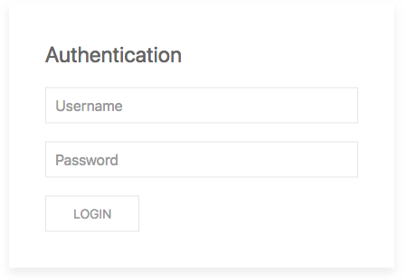
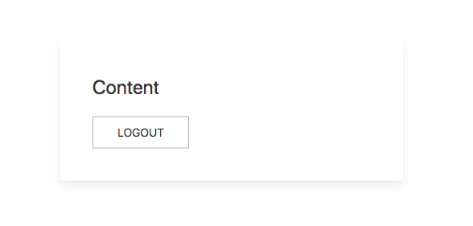
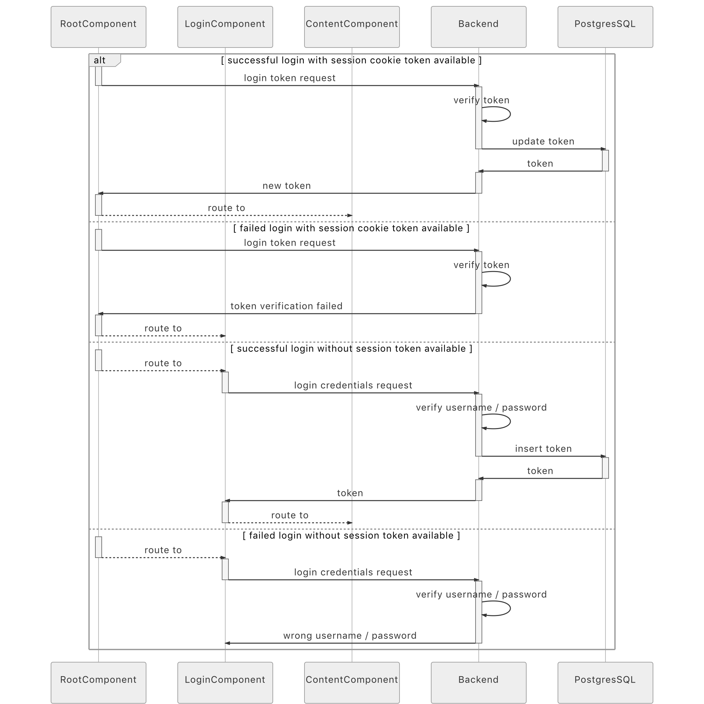

# WebApp.rs

[](https://circleci.com/gh/saschagrunert/webapp.rs)
[](https://codecov.io/gh/saschagrunert/webapp.rs)
[](https://saschagrunert.github.io/webapp.rs/doc/webapp/index.html)
[](https://docs.rs/webapp)
[](https://docs.rs/webapp-backend)
[](https://docs.rs/webapp-frontend)
[](https://github.com/saschagrunert/webapp.rs/blob/master/LICENSE)
[](https://crates.io/crates/webapp)
[](https://crates.io/crates/webapp-backend)
[](https://crates.io/crates/webapp-frontend)

## A web application completely written in Rust

Target of this project is to write a complete web application including backend
and frontend within Rust.

```console
Rust wasm             Rust app
in browser <- REST -> HTTP Server -- actix-web
 |                         |
Yew                   Diesel (ORM) -> PostgreSQL
```

### Blog Posts

1. [A Web Application completely in Rust](https://medium.com/@saschagrunert/a-web-application-completely-in-rust-6f6bdb6c4471).
2. [Lessons learned on writing web applications completely in Rust](https://medium.com/@saschagrunert/lessons-learned-on-writing-web-applications-completely-in-rust-2080d0990287).

## Build

The following build dependencies needs to be fulfilled to support the full
feature set of this application:

- [wasm-pack](https://rustwasm.github.io/docs/wasm-pack/introduction.html)
- [rollup](https://www.npmjs.com/package/rollup)
- [diesel_cli](https://github.com/diesel-rs/diesel)
- [postgresql (libpg)](https://www.postgresql.org/)
- A container runtime, like [podman](https://podman.io)

The app consist of a frontend and a backend. For getting started with hacking,
the backend can be tested via `make run-backend`, whereas the frontend can be
tested with `make run-frontend`. You can adapt the application configuration
within `Config.toml` if needed.

This installs build requirements, rust and wasm-pack, on Ubuntu or Debian.

```console
> sudo apt-get update
> sudo apt-get install -y pkg-config libssl-dev npm sudo wget
> wget https://sh.rustup.rs -O rustup-init
> sudo sh rustup-init -y
> cargo install wasm-pack
> sudo npm install -g rollup
```

This builds the project.

```console
> git clone https://github.com/saschagrunert/webapp.rs.git
> cd webapp.rs
> make all
```

## Run

`make deploy` uses podman to start a PostgreSQL container and the Rust backend
container. If you wish to use docker instead of podman, set
`CONTAINER_RUNTIME=docker` in the top of `Makefile`. Edit `Config.toml` if
needed to set the backend url and PostgreSQL credentials:

```toml
[server]
url = "http://127.0.0.1:30080"
...
[postgres]
host = "127.0.0.1"
username = "username"
password = ""
database = "database"
```

Ensure the runtime dependencies are installed, and then start the two containers.

```console
> sudo apt install -y postgresql-client
> cargo install diesel_cli --no-default-features --features "postgres"
> sudo make deploy
```

The application should now be accessible at
[`http://127.0.0.1:30080`](http://127.0.0.1:30080).
During development, you can start the containers separately, using
`make run-app` to start only the rust backend container, and `run-postgres` to
start only the PostgreSQL container.

If both the backend and frontend are running, you can visit the web application
at [`http://127.0.0.1:30080`](http://127.0.0.1:30080). After the successful
loading of the application you should see an authentication screen like this:



The login screen will accept any username and password that are equal, such as
`me` (username) and `me` (password). There is currently no further user
authentication yet, but non matching combination will result in an
authentication failure. After the successfully login you should be able to see
the content of the application:



The authentication should persist, it is even better after a manual page reload. Logging out
of the application via the logout button should also work as intended.

### Control Flow

The complete control flow of the application looks like this:



## Contributing

You want to contribute to this project? Wow, thanks! So please just fork it and
send me a pull request.
