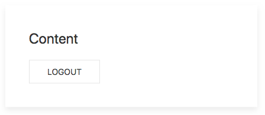

# WebApp.rs

[](https://circleci.com/gh/saschagrunert/webapp.rs)
[](https://codecov.io/gh/saschagrunert/webapp.rs)
[](https://deps.rs/repo/github/saschagrunert/webapp.rs)
[](https://saschagrunert.github.io/webapp.rs/doc/webapp/index.html)
[](https://github.com/saschagrunert/webapp.rs/blob/master/LICENSE)
[](https://crates.io/crates/webapp)

## A web application completely written in Rust

Target of this project is to write a complete web application including backend
and frontend within Rust.

### Blog Posts

1. [A Web Application completely in Rust](https://medium.com/@saschagrunert/a-web-application-completely-in-rust-6f6bdb6c4471).
2. [Lessons learned on writing web applications completely in Rust](https://medium.com/@saschagrunert/lessons-learned-on-writing-web-applications-completely-in-rust-2080d0990287).

## Build

The following build dependencies needs to be fulfilled to support the full
feature set of this application:

- [cargo-web](https://github.com/koute/cargo-web)
- [diesel_cli](https://github.com/diesel-rs/diesel)
- [postgresql (libpg)](https://www.postgresql.org/)
- A container runtime, like [podman](https://podman.io) or
  [docker](https://github.com/docker/docker-ce)

The app consist of a frontend and a backend. For getting started with hacking,
the backend can tested via `make run-backend`, whereas the frontend can be
tested with `make run-frontend`. You can adapt the application configuration
within `Config.toml` if needed.

## Run

If both, the backend and frontend are running, you can visit the web application
at [`http://127.0.0.1:8000`](http://127.0.0.1:8000). After the successful
loading of the application you should see an authentication screen like this:


Now you are able to login with a matching username and password combination like
`me` (username) and `me` (password). There is currently no further user
authentication yet, but non matching combination will result in an
authentication failure. After the successfully login you should be able to see
the content of the application:



The authentication should persist, even after a manual page reload. Logging out
of the application via the logout button should also work as intended.

### Control Flow

The complete control flow of the application looks like this:


## Deploy

To deploy the application as a docker image, simply run:

```console
make deploy
```

After that you can run the application side by side with a PostgreSQL container
via:

```console
make run-app
```

The application should now be accessible at
[`http://127.0.0.1:30080`](http://127.0.0.1:30080).

## Contributing

You want to contribute to this project? Wow, thanks! So please just fork it and
send me a pull request.
